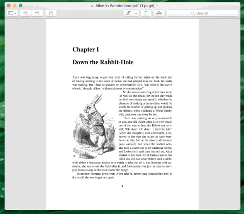
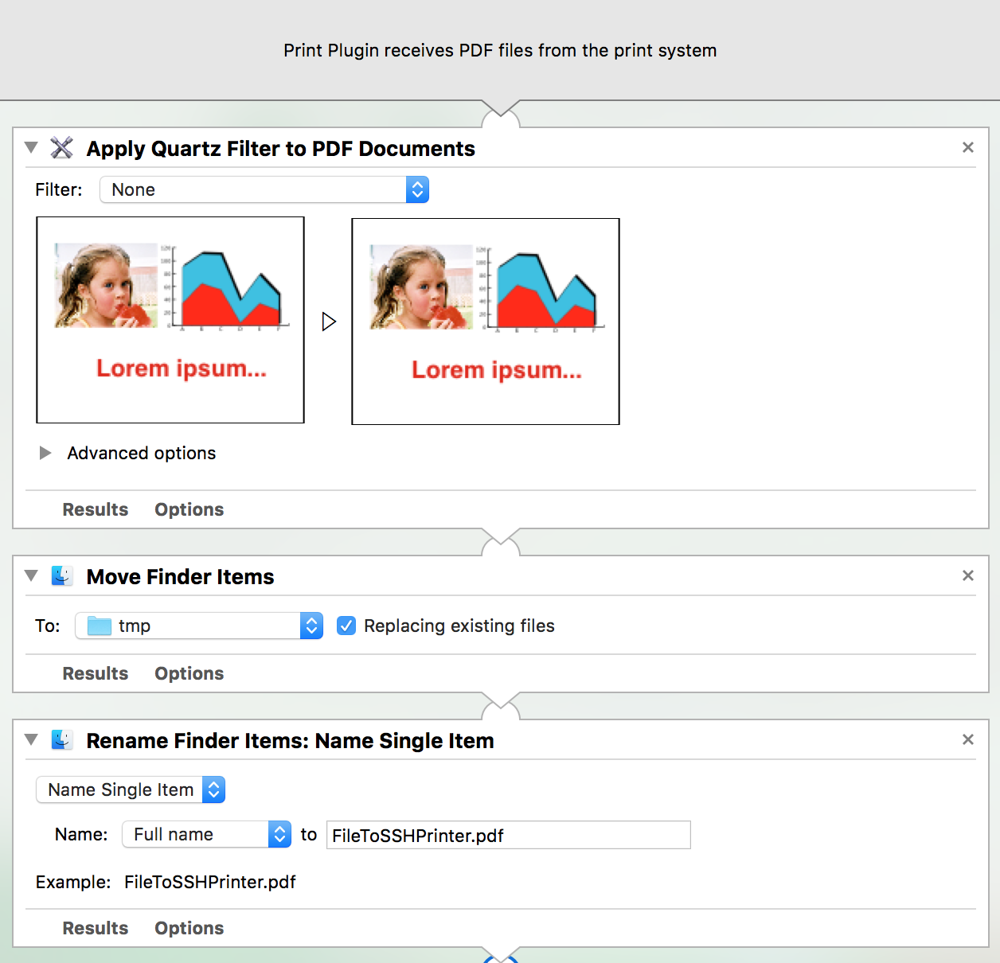
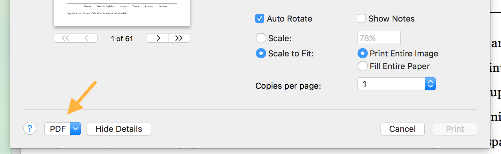

# Print over SSH for Mac OS X

This is a guide to make a utility that allows to print over SSH in Mac OS X. In other words, you can use your laptop to print using a printer connected to a server accessible through SSH.

<p align="center">
  
</p>

##Direct installation
The tutorial can be skipped by downloading the *Print over SSH.zip* file above. Double click on the unzipped file and open with Automator. Follow steps 8 and 9 below and save. Double click on the unzipped file and click install. To print over SSH, see the *usage* section below. To remove the password prompt, see the *No Password* section below.


##Tutorial

1. Launch *Automator* and create a new *Print Plugin*.

2. First of all, we need to apply a quartz filter due to a bug present in OS X El Capitan (10.11). To apply the filter drag *Actions -> PDFs -> Apply Quartz Filter to PDF Documents* on the workflow window and select *Filter: None*.

3. Not to have problems when printing the file over SSH, we need to we need to move the file and rename it with a clear and shorter name. To do so, drag *Actions -> Files & Folders -> Move Finder Items* into the workflow and tick *Replacing existing files*.

4. For the destination folder, select *Other...* and choose */tmp*. This is the system temporary folder, a folder whose content is erased upon reboot, so that we do not have to worry in case a file is not deleted.

5. Drag *Actions -> Files & Folders -> Rename Finder Items* into the workflow, select *Name Single Item*, *Full Name* and call the file *FileToSSHPrinter.pdf*. At this point the workflow looks like this:

  

6. Drag *Actions -> Utilities -> Run AppleScript* into the workflow and paste the following text into the text field:

	```applescript
	on run {input, parameters}

		choose from list {"Printer1", "Printer2", "Printer3"} default items {"Printer1"} with prompt "Please select the printer" with title "Print over SSH" without multiple selections allowed and empty selection allowed
		set printername to result as string
		if printername is "false" then return

		display dialog "How many copies?" default answer "1"
		set ncopies to text returned of result as string

		set commandTerminal to "ssh user@server lpr -P " & printername & " -# " & ncopies & " < /tmp/FileToSSHPrinter.pdf ; rm /tmp/FileToPhysicsPrinter.pdf; exit"

		tell application "Terminal"
			activate
			do script commandTerminal
		end tell

	end run
```

7. Replace the list of printers, *Printer1*, *Printer2*, *Printer3*, with the list of printer obtained by executing this command into a Terminal:

	```bash
	ssh user@server lpstat -a | awk '{print $1}'
	```
where *user@server* is your SSH address. Remember to replace the name of the default printer too.

8. Replace *user@server* with your SSH address.
9. Save the script as, for example, *Print over SSH*. Note that the script is saved in the *Printer services* folder ( ~/Library/PDF Services ) by default. In case you save it in another location, you can double click the saved file and select install. In this way, the file will be moved in the *Printer services* folder.

##Usage
To use the script, open the printer dialog normally, click on the dropdown menu on the bottom-left corner of the window and select *Print over SSH* or the alternative name you gave to the script.



Follow the onscreen instructions and a terminal will open, requiring to insert the password of the SSH user in order to print.

##No Password
It is possible to remove the terminal popup asking for the user SSH password by pairing your computer with the SSH server through RSA authentication. There are many tutorials in internet to do so, such as [this](http://www.linuxproblem.org/art_9.html). After you have completed the paring, you can substitute this block in the applescript field

```applescript
	tell application "Terminal"
		activate
		do script commandTerminal
	end tell
```

with

```applescript
	do shell script commandTerminal
```

After this, you will not be prompted for the password.